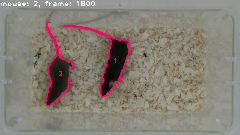

# Social Interaction Stopwatch

このプログラムは、ソーシャル・インタラクションテストで2個体のマウスが接触している時間を計測するためのプログラムです。

## 仕組み

|関数|画像|説明|
|:-|:-:|:-|
|[`cv2.VideoCapture.read()`](https://docs.opencv.org/4.x/d8/dfe/classcv_1_1VideoCapture.html#a473055e77dd7faa4d26d686226b292c1)||動画からフレームを取得します。|
|[`cv2.cvtColor(frame, cv2.COLOR_BGR2GRAY)`](https://docs.opencv.org/4.x/d8/d01/group__imgproc__color__conversions.html#ga397ae87e1288a81d2363b61574eb8cab)||フレームをグレースケールに変換します。|
|[`cv2.GaussianBlur(…)`](https://docs.opencv.org/4.x/d4/d86/group__imgproc__filter.html#gaabe8c836e97159a9193fb0b11ac52cf1)||フレームにガウスぼかしをかけます。|
|[`cv2.threshold(…)`](https://docs.opencv.org/4.x/d7/d1b/group__imgproc__misc.html#gae8a4a146d1ca78c626a53577199e9c57)||フレームを二値化します。|
|[`cv2.bitwise_not(…)`](https://docs.opencv.org/4.x/d2/de8/group__core__array.html#ga0002cf8b418479f4cb49a75442baee2f)||フレームを反転します。|
|[`cv2.findContours(…)`](https://docs.opencv.org/4.x/d3/dc0/group__imgproc__shape.html#gadf1ad6a0b82947fa1fe3c3d497f260e0)||二値化したフレームから輪郭を検出します。|
|[`cv2.contourArea(…)`](https://docs.opencv.org/4.x/d3/dc0/group__imgproc__shape.html#ga2c759ed9f497d4a618048a2f56dc97f1)||大きい輪郭を抽出します。|
|[`cv2.drawContours(…)`](https://docs.opencv.org/4.x/d6/d6e/group__imgproc__draw.html#ga746c0625f1781f1ffc9056259103edbc)||元のフレームに輪郭を描画します。|

## 動画フォーマットの変換

OpenCVで使用できる動画フォーマットは限られています。
あらかじめ`ffmpeg`を使用して、aviやmp4形式などに変換してください。

以下に使用例を示します。

```shell
ffmpeg -i ./movie.mts -vcodec copy -acodec copy ./movie.mp4
```

## 環境構築と実行方法

Dockerを使用します。

```shell
docker build -t social-interaction-stopwatch .
docker run -it social-interaction-stopwatch /bin/bash
python3 src/image.py
```
